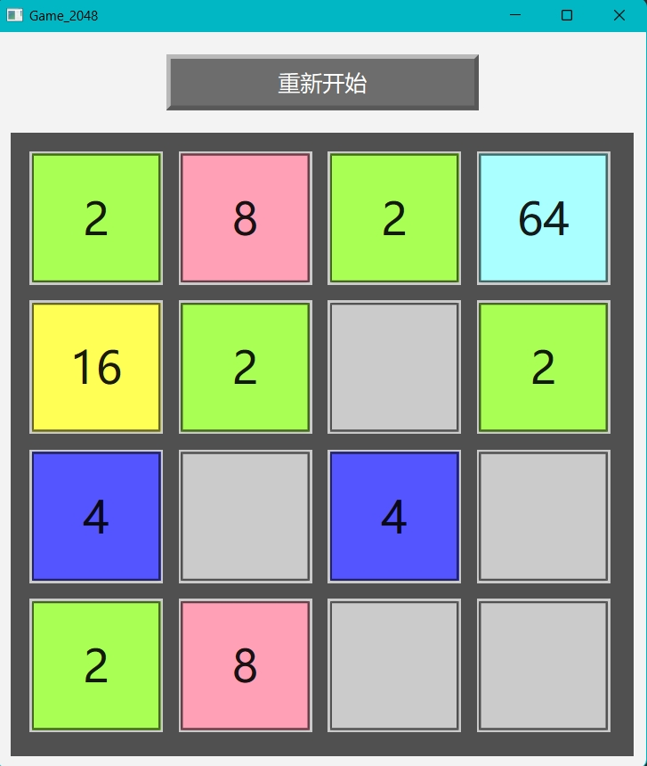
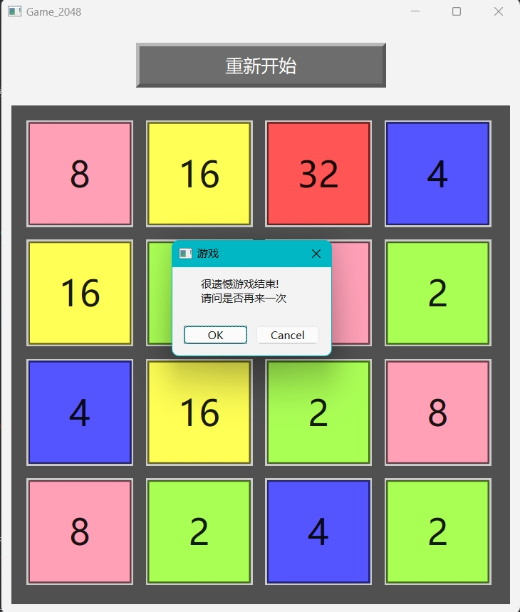

# Game_2048

这是我[HMCW仓库](https://github.com/capp-adocia/HMCW)里的一个小游戏。

## 声明

- 仅供个人参考学习
- 注意这里我并未处理当数字大于2048的相关逻辑，如果有需要可以自行添加

## 开发感想

- 关于这个小游戏，本来是我HMCW仓库里面的一个小游戏，我特地单独拿出来分享。
- 这个游戏虽然很早就有人开发出来了，但还是现在还是觉得挺上头的，休闲时刻玩玩还有点意思。
- 虽然我开发了有一段时间了，我现在最高记录还只是拥有一个1024方块和一个512方块，难受.😢😢😢

## 运行截图

1. 运行中 
2. 游戏结束 

## 联系方式

-  球球: 请通过 2636427505 联系我。
-  球球email: 请发送邮件至 [2636427505@qq.com](https://mail.qq.com/) 联系我。
-  B站: **是Kapa呀**
-  ......

(EN)
# Game_2048

This is a small game in my HMCW repository.

## Statement

- For personal reference and study only
- Note that I haven't handled the logic for when the number exceeds 2048 here; you can add it yourself if needed.

## Developer Reflections

- Regarding this small game, it was originally one of the games in my HMCW repository, and I specifically took it out to share separately.
- Although this game was developed quite some time ago, it's still pretty addictive and offers some fun during downtime.
- Although I've been developing it for a while, my highest record is still just having one 1024 block and one 512 block, which is frustrating.😢😢😢

## Run screenshot

1. Running 
2. GameOver 

## Contact Information

- QQ: Please contact me at 2636427505.
- QQ email: Please send an email to [2636427505@qq.com](https://mail.qq.com/) to contact me.
- Bilibili: **是Kapa呀**
- ......
